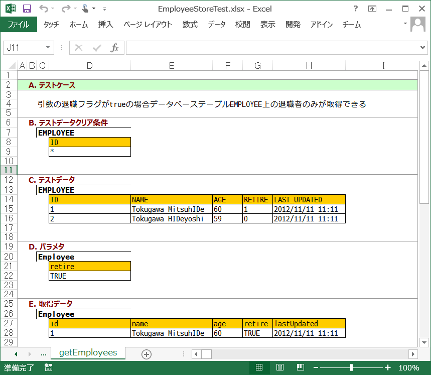
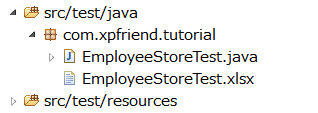
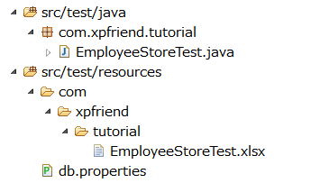

FixtureBook の使い方 (JUnit編)
==============================

1. 基本的な使い方
-----------------

FixtureBook の使い方はとてもシンプルです。

1.  テストで使用したいデータを FixtureBook (.xlsx ファイル) に記述する。
2.  FixtureBook を利用する単体テストを書く。


2 利用例
--------

例えば、以下のような「従業員クラス (Employee)」

```java
public class Employee {
    private int id;
    private String name;
    private int age;
    private boolean retire;
    private java.sql.Timestamp lastUpdated;

    public int getId() {return id;}
    public void setId(int id) {this.id = id;}

    public String getName() {return name;}
    public void setName(String name) {this.name = name;}
    ...
}
```

を利用するメソッド getEmployees

```java
    public class EmployeeStore {
        public List<Employee> getEmployees(Employee parameter) throws SQLException {
            try (Connection connection = getConnection();
                    PreparedStatement statement = connection
                            .prepareStatement("SELECT * FROM EMPLOYEE where RETIRE = ?")) {
                statement.setBoolean(1, parameter.isRetire());
                try (ResultSet resultSet = statement.executeQuery()) {
                    return getEmployees(resultSet);
                }
            }
        }
        
        private Connection getConnection() throws SQLException {
            return DriverManager.getConnection(
                    "jdbc:oracle:thin:@localhost:1521:xe", "scott", "tiger");
        }
    }
```

をテストしたい場合の例です。


#### 2.1 FixtureBook 記述例

次のようなシートのある .xlsx ファイルを作ります。



*   シート名はテスト対象メソッド名と同じにする（今回の例では「getEmployees」）。
*   `A.テストケース` の<b>C列</b>にテスト内容を一行で記述する。
*   テスト前にデータベース上に設定しておきたいデータを `B.テストデータクリア条件` と `C.テストデータ` に記述する
    （<b>C列</b>にテーブル名、<b>D列</b>以降に列値を指定）。
*   `D.パラメタ`には、メソッドの引数で渡すデータを記述する（<b>C列</b>にクラス名、<b>D列</b>以降にプロパティ値を指定）。
*   `E.取得データ`には、メソッドの戻り値として取得できるデータを予想して記述する（<b>C列</b>にクラス名、<b>D列</b>以降にプロパティ値を指定）。

作成した .xlsx ファイルは単体テストクラスのソースファイルと同じ名前にして（EmployeeStoreTest.groovy ならば EmployeeStoreTest.xlsx とする）、
単体テストクラスのソースファイルと同じのフォルダに保存します。



##### 参考
>パッケージ階層が同じであれば、ソースファイルは src/test/java の下、xlsx ファイルは src/test/resources の下
>という配置にすることも可能です。



#### 2.2 単体テスト記述例

単体テストは以下のように記述します。

*   単体テストクラス名は、`[テスト対象クラス名]Test` とする。
*   `import com.xpfriend.fixture.FixtureBook;` を追加する。
*   `Excelシート名__テストケース記述` という名前でテストメソッドを作成する。
*   `FixtureBook.expectReturn` メソッドでテスト対象メソッドを呼び出して、予想結果のチェックを行う。

&nbsp;

    ...
    import com.xpfriend.fixture.FixtureBook;

    ...

    public class EmployeeStoreTest {
        @Test
        public void getEmployees__引数の退職フラグがfalseの場合データベーステーブルEMPLOYEE上の未退職者のみが取得できる() {
            FixtureBook.expectReturn();
        }
    }


このテストを実行すると、以下の処理が行われます。

1.  `B.テストデータクリア条件` に記述された条件でデータベーステーブルからデータ行を削除した後に
    `C.テストデータ` に記述されたデータがデータベーステーブルに追加される。
2.  テスト対象クラス `EmployeeStore` のデフォルトコンストラクタが呼び出されて EmployeeStore のインスタンスが作成される。
3.  `D.パラメタ` に記述された内容で Employee クラスのインスタンスが作成され、引数（ `Employee p` ）として渡される。
4.  `EmployeeStore` の `getEmployees` がテスト対象メソッドとして実行される。
5.  `getEmployees` の戻り値が `E.取得データ` に記述した内容と合致しているかどうかがチェックされる。

##### 参考
>この例では、`expectReturn` を使いましたが、
>戻り値をチェックしない場合には `expect`、
>例外発生をチェックしたい場合には `expectThrown` が利用可能です。


3. API
------

### 3.1 FixtureBook クラスのメソッド

FixtureBook の操作は以下のメソッドで行うことができます。

<table>
  <tr><td>setup</td><td><code>B.テストデータクリア条件</code>に記述された条件でデータベースからデータ削除した後に<code>C.テストデータ</code>に記述されたデータをデータベースに追加する。</td></tr>
  <tr><td>getObject / getList / getArray</td><td><code>D.パラメタ</code>に記述した内容で初期化されたオブジェクトを取得する。</td></tr>
  <tr><td>validate</td><td>引数に指定されたオブジェクトが<code>E.取得データ</code>に記述した予想結果と同じかどうか検証する。</td></tr>
  <tr><td>validateStorage</td><td>DB上のデータが<code>F.更新後データ</code>に記述した予想結果と同じかどうか検証する。</td></tr>
  <tr><td>expect</td><td>(1)setup でデータのセットアップを行い, (2) getXxx でパラメタオブジェクトを取得し、(3) 引数に指定された処理（または命名規約から類推されるメソッド）を実行し、(4) validateStorage でデータ状態の検証を行う。</td></tr>
  <tr><td>expectReturn</td><td>(1)setup でデータのセットアップを行い, (2) getXxx でパラメタオブジェクトを取得し、(3) 引数に指定された処理（または命名規約から類推されるメソッド）を実行し、(4) validate で実行した処理の戻り値を検証し、(5) validateStorage でデータ状態の検証を行う。</td></tr>
  <tr><td>expectThrown</td><td>(1)setup でデータのセットアップを行い, (2) getXxx でパラメタオブジェクトを取得し、(3) 引数に指定された処理（または命名規約から類推されるメソッド）を実行し、(4) validate で実行した処理中に発生した例外を検証し、(5) validateStorage でデータ状態の検証を行う。</td></tr>
  <tr><td>validateParameterAt</td><td>expect / expectReturn / expectThrown を実行した後の引数の値が「E.取得データ」に記述された値と同じになっているかどうかを検証する。例えば <code>FixtureBook.expect(new Action()).validateParameterAt(0);</code> とすると、Action の持つメソッドの第一引数に渡された値が「E.取得データ」で記述されたものと同じになっているかどうかを検証できる。</td></tr>
</table>


### 3.2 FixtureBookPath アノテーションと Fixture アノテーション

以下のように、クラスまたはメソッドに `@FixtureBookPath` アノテーションを指定すると、
利用する .xlsx ファイルのパスを明示的に指定できます。

```java
    @FixtureBookPath("com/xpfriend/tutorial/EmployeeStoreTest_02.xlsx")
    public class EmployeeStoreTest
```

`@FixtureBookPath` アノテーションがクラスとメソッドの両方に付いている場合は、
メソッドで指定されたパスが優先的に利用されます。


「A.テストケース」記述の内容とメソッド名を同じにしたくない（または同じにできない）場合は、
以下のように `@Fixture` アノテーションが利用できます。

```java
    @Fixture({"getEmployees", "引数の退職フラグがtrueの場合データベーステーブルEMPLOYEE上の退職者のみが取得できる"})
    public void testMethod1() {
```


4. 利用上の制約
---------------

FixtureBook には現在のところ以下の制約があります。

*   Excelファイルは `.xlsx` 形式のみ利用可能 (`.xls` 形式ファイルは利用できない)。
*   動作確認テストをしているデータベースは Oracle および SQLServer です。


5. もっと詳しく!
----------------

FixtureBook について、もっと詳しく知りたいときは、以下のドキュメントも参照してみてください。

*   [チュートリアル (JUnit編)](./Tutorial-JUnit.md)
*   [FixtureBook 記述ルール](./FixtureBookReference.md)
